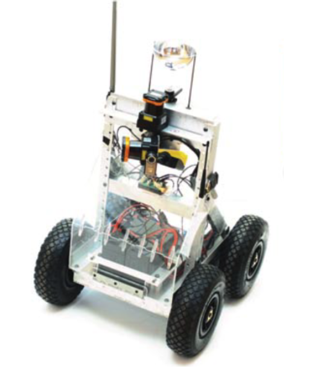
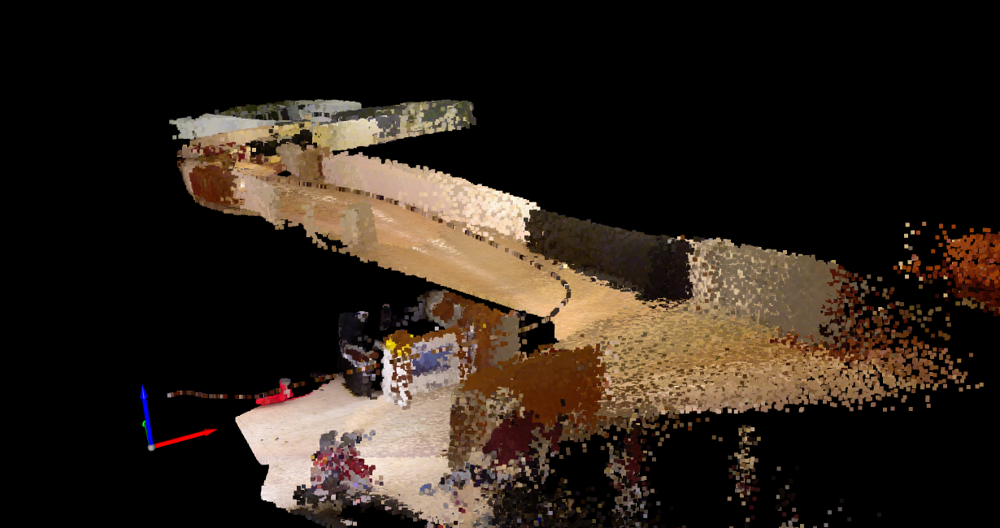
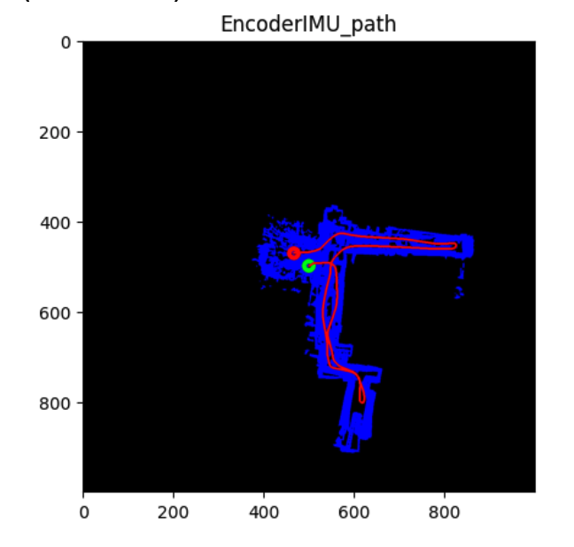
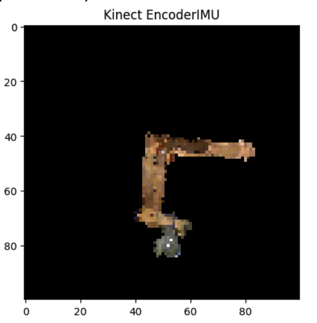

# LiDAR-Based SLAM 
## Overview

This repository contains the steps and methods utilized to accurately preform 
SLAM utilizing sensor data from encoders, LIDAR, IMU’s, and a RGBD camera. To do 
this we will implement several methods for localization such as encoder/IMU estimation 
and ICP scan matching. We also create occupancy grids using both lidar and 
camera approximations. Finally, we optimize the path estimations using factor 
graph optimization. The methods discussed in this project can be widely applied to 
localization and mapping projects as they are built on basic principles and therefore 
easily generalized.

Check Project PDF for thorough explanation and results. 
## Platform utilized         

## Features

    Encoder and IMU odometry: Utilizes encoder and IMU data to estimate the robot's position and orientation.

    Scan Matching: Uses ICP to match LIDAR scans and estimate the robot's position and orientation.
    
    Occupancy Grid Mapping: Constructs occupancy grids using LIDAR and camera data.

    Texture mapping: Constructs and occupancy grid using camera data.

    Factor Graph Optimization: Optimizes the robot's path estimation using factor graph optimization.

## Sample Output

3D Environment mapping using kinect camera and lidar scans  

    

Lidar scans and imu path estimation        

       

Occupancy grid mapping utilizing kinect camera  

   

## Dependencies

    numpy
    ICP project

## Data 

    Data not included but shape description can be found in project pdf 

# Install dependencies:

     pip install -r requirements.txt

## Usage

    Data Preparation:
        Ensure your dataset is structured as described in the project report.

    Run the Code:
        Execute the main script: python main.ipynb.
        Adjust dataset selection and other parameters as needed within the script.

## Project Structure

    main.py: Main script to run the project.

    Project 2.pdf: Project documentation.
    ../data/: Directory containing datasets.
